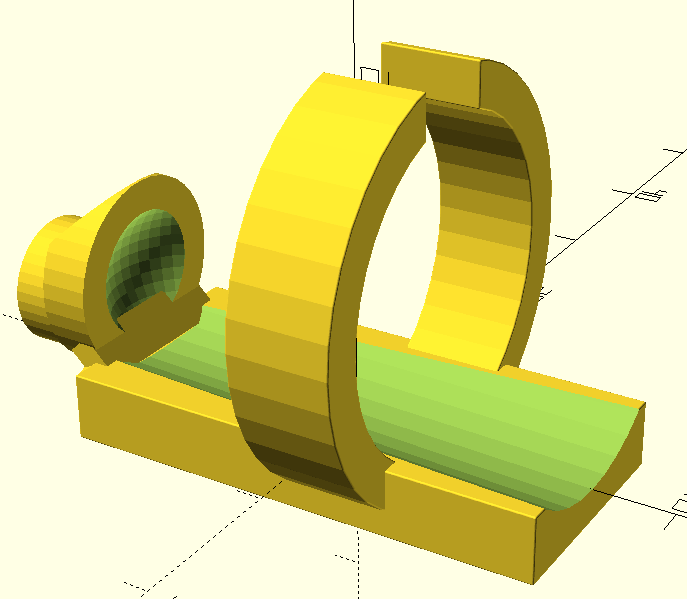
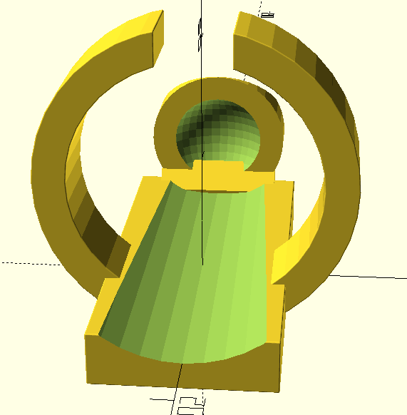
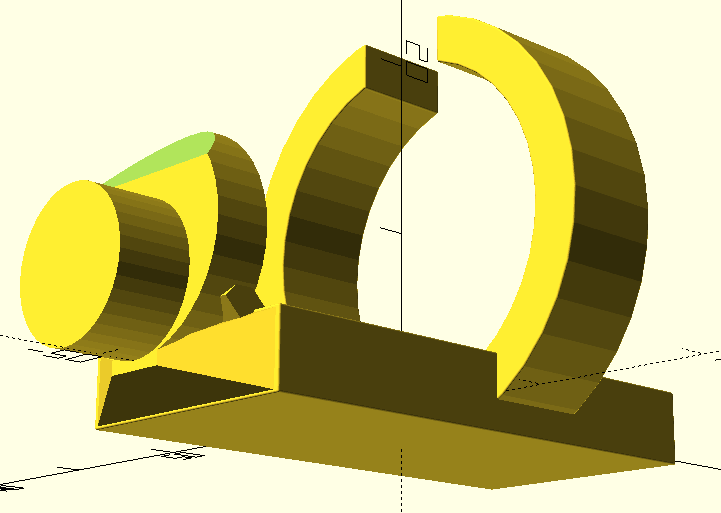
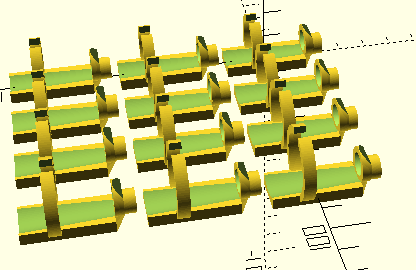

# Guitar Fat Fingers - Fine tip finger extension
Unusual idea to a common problem. 

## Description
Learning to play guitar is a wonderful thing!  
But many people struggle with large hands or fat fingers (or small hands) and they have difficulty to play chords. If only they had longer and fine tip fingers? So this is my take on the problem. It's a open source project and still a work in progress, but this is my take on it.  
The code is using the open source 3D development OpenSCAD and there are two files, one for a single unit (newer model, more reinforced) and a multiple unit (previous model with 4 size's) 3 units of each. The model is fully parameterized.

## Images 

  

 

  

 

  

 

  

## License
MIT Open Source License

## Have fun
Best regards,  
João Nuno Carvalho